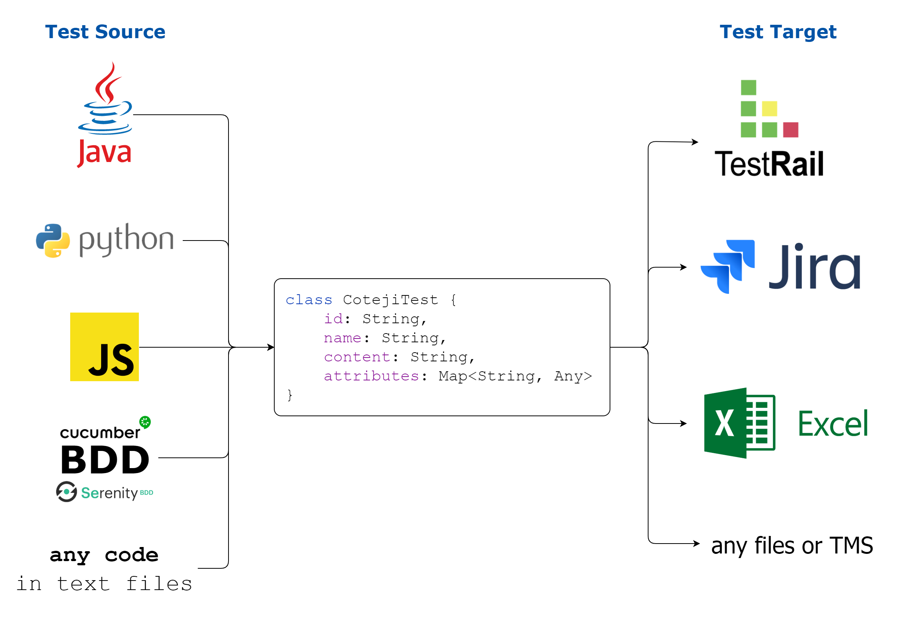
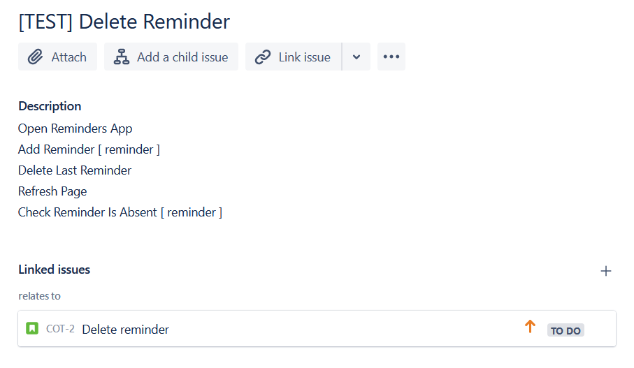

# Coteji

### Tool for tests migration

Coteji is the tool that allows you to keep your test cases as a code and syncronize them with your Test Management System (Jira, TestRail, etc.). So, for example, instead of creating and maintaining the same test both in the Java code and in Jira, you just maintain it in the code and run Cotegi from time to time to have it up to date in Jira.

## How it works
Coteji is the plug-in system. There are (will be) different implementations for tests sources (Java code, Python code, BDD files, etc.) and targets (Jira, TestRail, etc.). You should be able to use any combination of the source and the target. Configuration is done using a Kotlin script file.



So the target identifies which attributes you could provide and in the configuration script you write a function how to get this attribute from the test in the source. For example, your tests source is Java code and the target is Jira. To populate Jira ticket labels, you should provide the function that takes Java method as an input parameter, `Map<String, Any>` as an output, and within this function you put the list of lables to this map under the `labels` key.

There are couple options to run the syncronization:
- Command line tool
- Gradle/Maven plugin  

## Example
Let's say you have the following TestNG test:
```java
@Test(dataProvider = "deleteReminderData")
@UserStories({"COT-2"}) // example of your annotation
public void deleteReminder(Reminder reminder) {
    NavigationSteps.openRemindersApp();
    ReminderSteps.addReminder(reminder);
    ReminderSteps.deleteLastReminder();
    CommonUiSteps.refreshPage();
    ReminderSteps.checkReminderIsAbsent(reminder);
}
```
And the following Coteji configuration script (`config.coteji.kts`):
```kotlin
@file:DependsOn("io.github.coteji:coteji-source-java:0.2.0")
@file:DependsOn("io.github.coteji:coteji-target-jira:0.2.0")
import io.github.coteji.sources.*
import io.github.coteji.targets.*
import io.github.coteji.extensions.*

source = JavaCodeSource(
    testsDir = "D:\\Repos\\barvin\\coteji-source-java\\src\\test\\resources\\org\\example\\tests",
    getTestName = { "[TEST] " + this.nameAsString.separateByUpperCaseLetters() },
    lineTransform = {
        this.substringAfter(".")
            .separateByUpperCaseLetters()
            .replace("();", "")
            .replace("(", " [ ")
            .replace(");", " ]")
    }
)

target = JiraTarget(
    baseUrl = "https://coteji.atlassian.net",
    userName = "your@email.com",
    project = "COT",
    testIssueType = "Test Case"
)
```
Then after running the Coteji, the following Jira task is going to be created:



